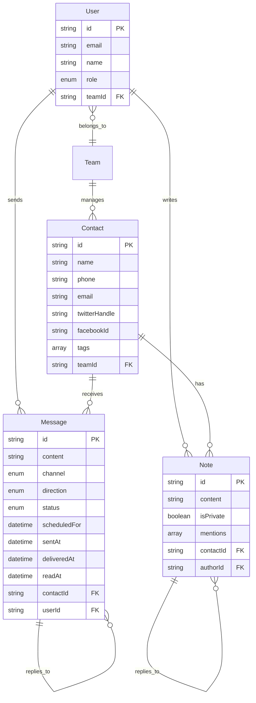

# Unified Multi-Channel Inbox

A comprehensive CRM-like communication platform for team-based customer engagement across SMS, WhatsApp, Email, Twitter DMs, and Facebook Messenger.

## 🚀 Features

- **Unified Inbox**: Aggregates messages from multiple channels into a single threaded view
- **Multi-Channel Support**: SMS, WhatsApp, Email, Twitter DMs, Facebook Messenger
- **Real-Time Communication**: Send and receive messages across all channels
- **Message Scheduling**: Schedule messages for future delivery with cron-based processing
- **Contact Management**: Comprehensive contact profiles with history, notes, and tags
- **Team Collaboration**: Internal notes with @mentions, private/public visibility
- **Analytics Dashboard**: Track metrics like response times, channel performance, conversion funnels
- **Twilio Integration**: Trial mode support with sandbox testing
- **Webhook Support**: Secure webhook handling for all integrated platforms

## 🏗️ Tech Stack

- **Frontend/Backend**: Next.js 14+ (App Router, TypeScript)
- **Database**: PostgreSQL with Prisma ORM
- **Authentication**: Better Auth (role-based access)
- **State Management**: React Query for server state
- **Styling**: Tailwind CSS
- **Charts**: Recharts
- **Integrations**:
  - Twilio SDK (SMS/WhatsApp)
  - Resend (Email)
  - Twitter API v2
  - Facebook Graph API

## 📋 Prerequisites

- Node.js 18+ and npm
- PostgreSQL database
- Twilio account ([Sign up free](https://www.twilio.com/try-twilio))
- (Optional) Resend account for email
- (Optional) Twitter Developer account
- (Optional) Facebook Developer account

## 🛠️ Setup Instructions

### 1. Clone and Install

```bash
git clone <your-repo-url>
cd unified-inbox
npm install
```

### 2. Database Setup

```bash
# Using Docker (recommended)
docker run --name postgres-unified-inbox \
  -e POSTGRES_PASSWORD=yourpassword \
  -e POSTGRES_DB=unified_inbox \
  -p 5432:5432 \
  -d postgres:15

# Or use Supabase/Railway/Render for cloud hosting
```

### 3. Environment Configuration

```bash
cp .env.example .env
```

Fill in your credentials in `.env`:

### 4. Database Migration

```bash
npx prisma generate
npx prisma db push
```

### 5. Start Development Server

```bash
npm run dev
```

Visit `http://localhost:3000`

## 🔧 Twilio Setup

1. Create a free Twilio account at [twilio.com/try-twilio](https://www.twilio.com/try-twilio)
2. Get your Account SID and Auth Token from the dashboard
3. Buy a phone number (trial numbers work for testing)
4. Enable WhatsApp Sandbox for testing WhatsApp messages
5. Configure webhooks in Twilio Console:
   - SMS Webhook URL: `https://your-domain.com/api/webhooks/twilio`
   - Status Callback URL: `https://your-domain.com/api/webhooks/twilio/status`

## 📊 Channel Integration Comparison

| Channel | Avg Latency | Cost/Message | Reliability | Features |
|---------|------------|--------------|-------------|----------|
| SMS | 50ms | $0.0075 | 99% | Text, MMS, Delivery Receipt |
| WhatsApp | 100ms | $0.005 | 98% | Text, Media, Read Receipt, Typing |
| Email | 2000ms | $0.001 | 97% | HTML, Attachments, Threading |
| Twitter DM | 500ms | Free | 95% | Text, Media, Read Receipt |
| Facebook | 300ms | Free | 96% | Text, Media, Read Receipt, Typing |

## 🏛️ Architecture

### Database Schema (ERD)



### Key Design Decisions

1. **Channel Abstraction**: Factory pattern (`createSender()`) allows easy addition of new channels
2. **Message Normalization**: Single `Message` table with channel-specific metadata in JSON
3. **Webhook Security**: Signature validation for all inbound webhooks (Twilio, Facebook, Twitter)
4. **Scheduling**: Database-driven with cron endpoint (`/api/scheduler/process`)
5. **Real-Time Updates**: React Query polling (5s interval) for live message updates
6. **Contact Deduplication**: Fuzzy matching on phone/email to auto-merge duplicates
7. **Team Collaboration**: Role-based access (Admin/Editor/Viewer) with @mentions in notes

## 📡 API Routes

### Messages
- `GET /api/messages` - List messages with filters
- `POST /api/messages` - Send new message
- `GET /api/messages/[id]` - Get message details
- `PATCH /api/messages/[id]` - Update message
- `DELETE /api/messages/[id]` - Delete message

### Contacts
- `GET /api/contacts` - List contacts
- `POST /api/contacts` - Create contact
- `GET /api/contacts/[id]` - Get contact details
- `PATCH /api/contacts/[id]` - Update contact
- `DELETE /api/contacts/[id]` - Delete contact
- `POST /api/contacts/[id]/notes` - Add note to contact

### Analytics
- `GET /api/analytics` - Get analytics data
- `GET /api/analytics/export` - Export data (JSON/CSV)

### Webhooks
- `POST /api/webhooks/twilio` - Twilio inbound messages
- `POST /api/webhooks/twilio/status` - Twilio status callbacks
- `GET/POST /api/webhooks/facebook` - Facebook Messenger
- `GET/POST /api/webhooks/twitter` - Twitter DMs

### Scheduler
- `POST /api/scheduler/process` - Process scheduled messages
- `POST /api/scheduler/templates` - Create message template

## ⚙️ Message Scheduling

Set up a cron job to process scheduled messages:

```bash
# Add to crontab (runs every minute)
* * * * * curl -X POST \
  -H "Authorization: Bearer YOUR_CRON_SECRET" \
  https://your-domain.com/api/scheduler/process
```

Or use services like:
- Vercel Cron Jobs
- GitHub Actions (scheduled workflows)
- Render Cron Jobs

## 🔐 Security Considerations

1. **Webhook Validation**: All webhooks verify signatures
2. **Environment Variables**: Sensitive data in `.env` (never commit)
3. **Rate Limiting**: Implement rate limiting for API routes
4. **CORS**: Configure allowed origins in production
5. **SQL Injection**: Prisma ORM prevents SQL injection
6. **XSS Protection**: Input sanitization on user-generated content

## 🧪 Testing

```bash
# Run tests (if implemented)
npm test

# Type checking
npx tsc --noEmit

# Linting
npm run lint
```

## 📈 Performance Optimizations

1. **Database Indexes**: Created on frequently queried fields
2. **Query Optimization**: Use Prisma's `include` strategically
3. **Pagination**: Implemented on all list endpoints
4. **React Query Caching**: 5-minute cache for static data
5. **Optimistic Updates**: UI updates before server confirmation

## 🚀 Deployment

### Vercel (Recommended)

```bash
# Install Vercel CLI
npm i -g vercel

# Deploy
vercel
```

### Environment Variables in Production
Add all variables from `.env.example` to your hosting platform

### Database
Use managed PostgreSQL:
- Supabase
- Railway
- Render
- AWS RDS

## 📝 TODO / Roadmap

- [ ] WebSocket implementation for real-time updates
- [ ] File upload support for attachments
- [ ] Advanced search with full-text search
- [ ] Bulk message operations
- [ ] Email templates with variables
- [ ] SMS/WhatsApp templates (Twilio approved)
- [ ] Conversation assignment to team members
- [ ] SLA tracking and alerts
- [ ] HubSpot/Salesforce CRM sync
- [ ] Slack notifications integration
- [ ] Mobile app (React Native)

## 🤝 Contributing

1. Fork the repository
2. Create feature branch (`git checkout -b feature/amazing-feature`)
3. Commit changes (`git commit -m 'Add amazing feature'`)
4. Push to branch (`git push origin feature/amazing-feature`)
5. Open Pull Request

## 📄 License

MIT License - see LICENSE file for details

## 🆘 Support

For issues and questions:
- GitHub Issues: [your-repo/issues]
- Email: team@yourdomain.com

## 🙏 Acknowledgments

- Twilio for comprehensive communication APIs
- Vercel for seamless deployment
- Prisma for excellent ORM
- React Query for state management

---

Built with ❤️ for Attack Capital Assignment